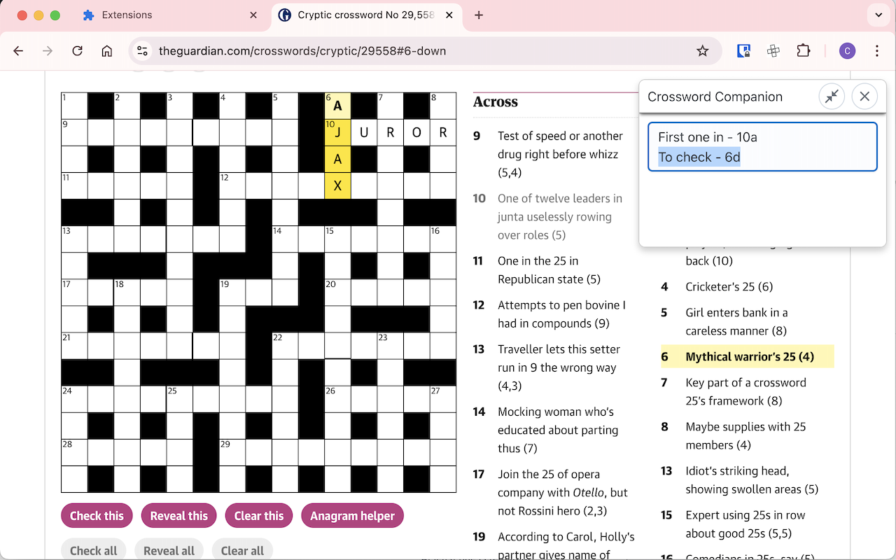

This extension adds an overlay to a webpage which provides some useful features for solving crosswords:

Download this extension from the Chrome Web Store: https://chromewebstore.google.com/detail/crossword-companion/olnojhhheedghnpnfaompfeombpcpbnk

## Features

**Notes**

Let's you keep track of any notes which are useful when solving, such as clues you need to look up the parsing for or are not sure about:

**Large Cursor**

Shows a larger cursor, useful if demoing or recording crosswords, where you may want a more visible cursor when pointing at elements of clues.
